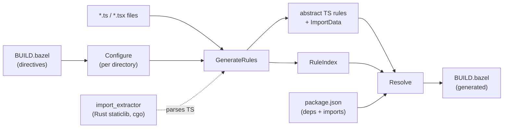

# gazelle_ts

Bazel build setup, a Gazelle TypeScript language extension, and the Rust import-extractor that powers it through cgo.

Built on **Bazel 8.5+ (bzlmod)** with [`rules_rs`](https://github.com/dzbarsky/rules_rs) for the Rust side and `aspect_rules_ts` / `aspect_rules_js` for the TypeScript examples. Tested in CI against Bazel 8.5.1 and 9.0.0.

- [Layout](#layout)
- [What this repo gives you](#what-this-repo-gives-you)
- [Consumer setup](#consumer-setup)
- [TypeScript language reference](#typescript-language-reference)
- [Build](#build)

## Layout

```
crates/
└── import_extractor/         # Rust staticlib: TS import extraction (oxc).
                              # Linked into the gazelle plugin via cgo.
ts/                           # Go-based Gazelle language extension that emits
                              # abstract ts_library / ts_test / ts_binary rules.
examples/                     # self-contained Bazel workspaces:
├── basic/                    #   one TS package, npm deps, .ts + .tsx + smoke test
├── bundler-config/           #   separate config targets for vite/vitest/tailwind
├── composite/                #   multi-package with #packages/* cross-refs
├── graphql/                  #   @graphql-codegen -> npm_package -> composite app
└── advanced/                 #   composite + Bazel-built synthetic npm_package
```

## What this repo gives you

- **`ts`**: a Gazelle TypeScript language extension. It generates and maintains `BUILD.bazel` files for TypeScript packages, emits abstract `ts_library`, `ts_test`, `ts_binary`, and `ts_bundler_config` kinds, and lets consumers map those kinds to project-specific macros with `# gazelle:map_kind`. It reads `package.json` `imports` for subpath resolution. Consume it by composing your own `gazelle_binary(languages = ["@gazelle_ts//ts"])`.
- **`crates/import_extractor`**: a Rust staticlib that parses TypeScript imports via `oxc`. It exposes a plugin-namespaced C ABI (`gazelle_ts_ie_dispatch` / `gazelle_ts_ie_free`); the gazelle plugin links it through cgo and dispatches in-process. See [crates/import_extractor/README.md](crates/import_extractor/README.md).
- **`examples/`**: escalating example workspaces, each with its own `MODULE.bazel`, `pnpm-lock.yaml`, and `tsconfig.json`. They `local_path_override` the parent module so plugin changes apply on the next `bazel run //:gazelle`. See [examples/README.md](examples/README.md).

## Consumer Setup

Add the module and compose your own `gazelle_binary`:

```python
# MODULE.bazel
bazel_dep(name = "gazelle", version = "0.50.0")
bazel_dep(name = "gazelle_ts", version = "<latest>")

# Required so the consumer .bazelrc below can reference @llvm directly.
# bzlmod doesn't transitively expose deps' repos.
bazel_dep(name = "llvm", version = "0.7.6")
```

> [!NOTE]
> `gazelle_ts` registers a hermetic `@llvm` cc toolchain so the rules_rs Rust toolchain does not trip Bazel's Xcode autodetect on macOS. To use it from a consumer workspace, mirror these flags in your own `.bazelrc`; Bazel only reads the consumer's rc, not a dependency's:
>
> ```
> common --enable_platform_specific_config
>
> # Linux/Windows: pin host_platform so rules_rs's Rust toolchains match the
> # gnu.2.28 libc / msvc constraints they tag via target_compatible_with.
> common:linux --host_platform=@gazelle_ts//platforms:local_gnu
> common:windows --host_platform=@gazelle_ts//platforms:local_windows_msvc
>
> # Suppress Bazel's autodetected cc toolchain so @llvm wins resolution
> # cleanly. NO_APPLE specifically avoids the XcodeLocalEnvProvider
> # duplicate-SDKROOT crash on macOS.
> common --repo_env=BAZEL_DO_NOT_DETECT_CPP_TOOLCHAIN=1
> common --repo_env=BAZEL_NO_APPLE_CPP_TOOLCHAIN=1
>
> # rust stdlib's link spec hardcodes -lgcc_s; @llvm's clang does not
> # ship it, so we inject an empty stub.
> common --@llvm//config:experimental_stub_libgcc_s=True
>
> # rules_go cgo external link via clang+lld cannot produce PIE. Drop
> # when Go 1.27 (Aug 2026) lands PIE-compatible objects.
> build:linux --linkopt=-no-pie
> ```
>
> See [examples/basic/.bazelrc](examples/basic/.bazelrc) for a working setup.

```python
# BUILD.bazel
load("@gazelle//:def.bzl", "gazelle", "gazelle_binary")

# gazelle:ts_npm_link_pattern //:node_modules/{pkg}

gazelle_binary(
    name = "gazelle_bin",
    languages = ["@gazelle_ts//ts"],
)

gazelle(
    name = "gazelle",
    gazelle = ":gazelle_bin",
)
```

Then run `bazel run //:gazelle`.

`@gazelle_ts//ts` is a Gazelle language; you compose your own `gazelle_binary` so it can be combined with other languages (`go`, `python`, `proto`, etc.) into a single binary.

The plugin emits four abstract kinds, all loaded from `@gazelle_ts//ts:defs.bzl`:

- `ts_library` for libraries.
- `ts_test` for tests. It assumes a multi-entry runner such as vitest, jest, or mocha; no `entry_point` is set.
- `ts_binary` for hand-written binary entry points. Gazelle never generates these, but auto-manages the rule's `data` from `entry_point` / `srcs` imports, matching the stock `js_binary` lifecycle.
- `ts_bundler_config` for files matched by `ts_bundler_config_pattern`.

Consumers should `# gazelle:map_kind` each abstract kind to a project-specific macro, typically a small wrapper over `ts_project`, `vitest_test`, `js_binary`, or equivalent rules. The plugin deliberately does not take a transitive `aspect_rules_ts` or `aspect_rules_js` dependency, and project-specific macros own defaults such as transpilers, tsconfig, project-reference flags, entry point picking, `NODE_OPTIONS`, and launcher scripts.

`js_binary` is recognized too as a legacy or concrete alternative. It has the same `data`-management lifecycle as `ts_binary`, without abstract-kind wrapping.

## TypeScript Language Reference

### Architecture



The plugin runs in three phases per Gazelle's lifecycle:

1. **Configure** ([ts/configure.go](ts/configure.go)): walks the directory tree, applying each directory's BUILD-file directives on top of inherited config.
2. **GenerateRules** ([ts/generate.go](ts/generate.go)): partitions files into source, test, and bundler-config buckets; calls into the Rust staticlib via cgo to extract imports; and emits generated rules.
3. **Resolve** ([ts/resolve.go](ts/resolve.go)): converts parsed import statements into Bazel deps using the RuleIndex for cross-package refs and `package.json` for npm packages.

The Rust crate at [crates/import_extractor](crates/import_extractor) is built as a `rust_static_library` and linked into the Go library via `cdeps`. Calls into it go through cgo, with protobuf via `prost` as the in-process wire format.

The plugin's separation of `Imports` (provider side) from `Resolve` (consumer side) is what makes cross-directory references work: `Imports()` registers each library at its package path in the RuleIndex, and `Resolve()` queries that index to convert `#packages/foo/bar.ts` style paths into `//packages/foo` labels.

### Supported Import Patterns

The Rust parser handles every TypeScript import form; the resolver categorizes each one. Listed in roughly the order the resolver checks them:

| Pattern | Example | Resolves to |
|---|---|---|
| **Relative** | `./util`, `../shared/types` | _no dep added_; covered by the package's own srcs |
| **Generated package override** | `@myrepo_generated/foo` when configured via `gazelle:resolve_regexp` | The configured Bazel label, with regexp captures substituted |
| **Subpath import** | `#packages/foo/bar.ts` when `package.json` has `"#packages/*": "./packages/*"` | An internal `//packages/foo` label looked up via the RuleIndex |
| **Generated subpath import** | `#generated/typespec/rest/users/index.js` when `package.json` maps `"#generated/typespec/rest/*/index.js"` | The generated package label looked up via the RuleIndex, e.g. `//typespec/rest/users:users.web` |
| **Node.js builtin** | `fs`, `path`, `node:crypto` | `//:node_modules/@types/node`, configurable via `ts_npm_link_pattern` |
| **Bare npm package** | `react`, `lodash` | `//:node_modules/react`, plus `//:node_modules/@types/react` if present |
| **Scoped npm package** | `@mui/material`, `@tanstack/react-query` | `//:node_modules/@mui/material` |
| **npm subpath** | `lodash/debounce`, `@tanstack/react-query/devtools` | `//:node_modules/lodash`, the package rather than the subpath |
| **Type-only `import type`** | `import type { Foo } from 'react'` | Same as the runtime import; TypeScript needs the dep at type-check time |
| **Inline import type** | `import('postcss').Root` | Same as a regular `import 'postcss'` |
| **Dynamic import** | `await import('lazy-mod')` | Same as `import 'lazy-mod'` |
| **Side-effect import** | `import 'reflect-metadata'`, `import './styles.css'` | Same as a regular import |
| **Re-export from** | `export * from 'foo'`, `export { x } from 'foo'` | Same as `import 'foo'` |

A few cases are intentionally not resolved:

- **CSS / asset imports** such as `import './styles.css'` are returned as raw strings; the resolver skips them as relative imports. If your build needs them as `data` deps, add them via `# keep` lines or a `ts_test_data` directive.
- **TypeScript path mapping** from `tsconfig.json`'s `paths` field is not honored. Use Gazelle's native `resolve` / `resolve_regexp` directives for explicit overrides, or rely on `package.json` `imports`; both are stricter than `paths` and play well with the Bazel sandbox.
- **`require(...)` calls** are not parsed. The plugin is TypeScript-first; CommonJS in `.ts` files is rare in practice.

### `package.json` `imports`

`gazelle_ts` reads the root `package.json` `imports` map and uses it for TS dependency resolution. This is the preferred way to describe internal `#...` subpath imports because the same mapping is visible to Node.js, TypeScript's bundler resolution, and Gazelle.

```json
{
  "imports": {
    "#packages/*": "./packages/*",
    "#generated/typespec/rest/*/index.js": "./typespec/rest/*",
    "#generated/protobuf/*": [
      "./bazel-bin/generated/protobuf/*",
      "./generated/protobuf/*"
    ]
  }
}
```

For path targets such as `./typespec/rest/*`, Gazelle substitutes the single `*` capture and asks its RuleIndex for the longest matching TS package. If `//typespec/rest/users` contains a generated or hand-written `ts_library(name = "users.web")`, then `import "#generated/typespec/rest/users/index.js"` resolves to `//typespec/rest/users:users.web`.

Targets that start with `//` or `@` are treated as Bazel label templates instead:

```json
{
  "imports": {
    "#generated/npm/*/index.js": "//generated/npm/*:*.web"
  }
}
```

Gazelle resolves `imports` targets to a single dependency, matching Node's ordered resolution model rather than adding every possible environment target:

1. Native `gazelle:resolve ts ...` and `gazelle:resolve_regexp ts ...` overrides win before `package.json` `imports`.
2. Matching `imports` entries are checked by longest key first.
3. A string target is used directly.
4. An array target is treated as ordered fallback: Gazelle tries each entry and uses the first target that resolves to a valid Bazel label or RuleIndex package.
5. A conditional object is evaluated in declaration order: Gazelle takes the first supported condition whose target resolves. Nested condition objects follow the same rule.
6. A `null` target means no mapping for that branch.
7. If no target resolves, Gazelle treats the import as unresolved and continues with the normal builtin/npm fallback logic.

Supported target value shapes match Node's package target forms:

| Value shape | Example | Gazelle behavior |
|---|---|---|
| String | `"#foo": "./foo/index.js"` | Resolve the string target. |
| Array fallback | `"#foo": ["./bazel-bin/foo.js", "./foo.js"]` | Try each supported target in order. |
| Conditional object | `"#foo": {"node": "./foo-node.js", "default": "./foo.js"}` | Evaluate supported conditions in declaration order; nested condition objects are supported. |
| `null` | `"#foo/private/*": null` | Treat as no mapping. |

The resolver recognizes the `types`, `node-addons`, `node`, `import`, `module-sync`, and `default` conditions. Other conditions are ignored unless a later supported condition provides a target.

### Recommendations

- **Wire concrete macros via `# gazelle:map_kind`.** The plugin emits abstract kinds. Consumers wrap them in small macros that forward to their chosen implementation and set project-specific defaults. Without `map_kind`, the fallback in `@gazelle_ts//ts:defs.bzl` collects srcs/deps/data into a `filegroup` so the BUILD still loads, but nothing typechecks.
- **Use `package.json` `imports` for internal cross-package references and generated subpaths.** Configuring `"#packages/*": "./packages/*"` or `"#generated/foo/*/index.js": "./generated/foo/*"` lets source, TypeScript, Node.js, bundlers, and Gazelle agree on resolution. The plugin reads the same map and resolves to internal Bazel labels.
- **In monorepos, set TypeScript project references in your wrapper macro.** Set `composite = True`, `declaration = True`, and `source_map = True` inside the macro behind `ts_library`; the wrapper runs once and applies to every emitted library.
- **Pin one npm linker layout via `ts_npm_link_pattern`.** rules_js pnpm projects often use `//<dir>:node_modules/{pkg}`; the default `//:node_modules/{pkg}` is right for the simplest setup.
- **Do not fight the merge engine.** Attrs the plugin sets are listed below. Attrs it does not set are preserved across runs, so manual overrides such as custom `transpiler`, extra `args`, or opt-in `declaration_dir` survive.
- **Annotate generated files with `# keep`.** If a file would be excluded by the test pattern but you want it in `srcs`, such as a checked-in `*.generated.ts` fixture, add `"foo.generated.ts",  # keep` to the `srcs` list.

### Directives

All directives are placed in `BUILD.bazel` as `# gazelle:<key> <value>` and inherit into subdirectories.

| Directive | Default | Notes |
|---|---|---|
| `ts_enabled` | `true` | Disable per-tree to skip directories owned by another tool. |
| `ts_library_name` | package basename, e.g. `web` for `//apps/web` | Name of the generated library rule. |
| `ts_test_name` | package basename + `_test`, e.g. `web_test` | Name of the generated test rule. |
| `ts_visibility` | `//visibility:public` | Repeatable / space-separated list. |
| `ts_test_pattern` | `*.test.ts`, `*.test.tsx`, `tests/**`, `test/**`, `**/*.test.ts`, `**/*.test.tsx`, `**/*.spec.ts`, `**/*.spec.tsx` | Repeatable; appended. |
| `ts_extension` | `.ts`, `.tsx` | Repeatable; appended. |
| `ts_npm_link_pattern` | `//:node_modules/{pkg}` | Template; `{pkg}` is replaced with the resolved package name. |
| `ts_test_data` | empty | Repeatable; appended to every test rule's `data`. |
| `ts_tsconfig_types` | `node` | Repeatable / space-separated allowlist of ambient type package names. When a matching `@types/*` dep is resolved, the unprefixed name is emitted in `tsconfig_types`. |
| `ts_bundler_config_pattern` | empty | Repeatable `<glob> <name>` entries. Files matching the glob are excluded from the library and emitted as a separate `ts_bundler_config` target named `<name>`. Use for vite/vitest/tailwind/storybook configs whose deps should not enter the lib's compilation closure. |

#### Non-Production TypeScript Sources

`gazelle_ts` already separates files matching `ts_test_pattern` from the generated `ts_library`. Use this for test-adjacent sources that are not named `*.test.ts(x)` but should live with the test target:

```bzl
# gazelle:ts_test_pattern __tests__/**/*.ts
# gazelle:ts_test_pattern __tests__/**/*.tsx
```

Use Gazelle's built-in `exclude` directive for files owned by another package or app shape, such as Storybook config:

```bzl
# gazelle:exclude .storybook/**
# gazelle:exclude vitest.storybook.config.ts
```

#### Generated Package Overrides

```
# Map @myrepo_generated/* directly to Bazel linker labels.
# gazelle:resolve_regexp ts ^@myrepo_generated/(.*)$ //:node_modules/@myrepo_generated/$1
```

Use `package.json` `imports` for workspace path aliases such as `#packages/*`: the plugin reads that map and walks the RuleIndex to find the longest matching package.

#### Local Ambient Type Packages

For a local `.d.ts`-only package that declares globals and is never imported, keep both the local dep and the `tsconfig_types` entry on the consuming rule:

```bzl
# gazelle:ts_tsconfig_types custom-ambient

ts_library(
    name = "lib",
    deps = [
        "//vendor/@types/custom-ambient",  # keep
    ],
    tsconfig_types = [
        "custom-ambient",  # keep
    ],
)
```

The local type package itself can be a normal generated `.d.ts`-only target:

```bzl
ts_library(
    name = "custom-ambient",
    srcs = ["index.d.ts"],
)
```

#### `ts_bundler_config_pattern` Examples

Bundler/tooling config files such as vite, vitest, tailwind, and storybook configs typically live alongside library sources but pull in build-time-only deps (`vite`, `@vitejs/plugin-react`, `vitest`) that should not enter the library's runtime closure. `ts_bundler_config_pattern` peels each matched file into a separate `ts_bundler_config` target so it typechecks as its own compilation unit.

```
# gazelle:ts_bundler_config_pattern vite.config.* vite_config
# gazelle:ts_bundler_config_pattern vitest.config.* vitest_config
# gazelle:ts_bundler_config_pattern tailwind.config.ts tailwind_config
# gazelle:ts_bundler_config_pattern .storybook/main.ts storybook_config
```

For a package laid out like:

```
app/
├── BUILD.bazel
├── index.ts                # imports react, ./helpers
├── helpers.ts              # imports lodash
├── vite.config.ts          # imports vite, @vitejs/plugin-react, ./viteHelpers
├── viteHelpers.ts          # imports node:path
└── index.test.ts           # imports vitest, ./index
```

the plugin emits, before `map_kind` rewrite:

```python
ts_library(
    name = "app",
    srcs = ["helpers.ts", "index.ts", "viteHelpers.ts"],
    deps = [
        "//:node_modules/@types/node",
        "//:node_modules/lodash",
        "//:node_modules/react",
    ],
    tsconfig_types = ["node"],
)

ts_bundler_config(
    name = "vite_config",
    srcs = ["vite.config.ts"],
    deps = [
        "//:node_modules/@vitejs/plugin-react",
        "//:node_modules/vite",
        ":app",  # vite.config.ts imports ./viteHelpers, which lives in :app
    ],
)

ts_test(
    name = "app_test",
    srcs = ["index.test.ts"],
    deps = [":app", "//:node_modules/vitest"],
)
```

Key behaviors:

- **Glob syntax** is full doublestar: `*` is a single-segment wildcard and `**` spans directories.
- **Longest pattern wins** when multiple specs match the same file.
- **Bundler-config classification overrides the test split**: a file matching both `*.test.ts` and a bundler-config pattern goes to the bundler-config target.
- **Multiple specs may share a name**: pointing several patterns at one target merges their files into a single rule.
- **Helpers stay in lib.** If `vite.config.ts` and `lib.ts` both import `./shared.ts`, `shared.ts` lands in the library and the bundler-config target adds `:lib` to its deps. The closure leaks bundler to lib, but never lib to bundler.
- **`lib.ts` importing a bundler-config file is a build error.** The resolver does not route the import to the bundler-config target; the import goes unresolved and typecheck fails.

`ts_bundler_config`, like `ts_library`, is an abstract kind requiring `map_kind`. The distinct kind name lets `map_kind ts_bundler_config <macro>` rewrite bundler-config emissions independently of `ts_library`. See [examples/bundler-config](examples/bundler-config) for a complete walkthrough.

### Generated Attrs

#### `ts_library` (abstract)

| Attr | Set by | Behavior |
|---|---|---|
| `name` | generate | non-empty required |
| `srcs` | generate | mergeable, preserves `# keep` lines |
| `visibility` | generate | overwritten each run |
| `deps` | resolve | replaced each run |
| `tsconfig_types` | resolve | mergeable; inferred from resolved `@types/*` deps allowlisted by `ts_tsconfig_types`, e.g. `@types/node` -> `node` |
| anything else | _untouched_ | manual overrides survive across runs |

`composite`, `declaration`, `source_map`, `transpiler`, `tsconfig`, and similar compile-shape attrs are not emitted by the plugin; they belong to the macro you map_kind `ts_library` to. `tsconfig_types` is the exception because it is derived from resolved ambient `@types/*` deps.

#### `ts_test` (abstract)

| Attr | Set by | Behavior |
|---|---|---|
| `name` | generate | non-empty required |
| `srcs` | generate | mergeable; test entrypoints only |
| `deps` | generate + resolve | mergeable; sibling library label plus imports from test files |
| `data` | generate | mergeable; runtime-only fixtures from `ts_test_data` or `# keep` |
| `tsconfig_types` | resolve | mergeable; inferred from resolved test-only `@types/*` deps allowlisted by `ts_tsconfig_types` |
| anything else | _untouched_ | manual overrides survive across runs |

No `entry_point` is emitted. `ts_test` assumes a multi-entry runner such as vitest, jest, or mocha. Wrappers mapped to single-entry runners such as stock `js_test` need to pick one from `srcs` themselves.

#### `ts_binary` / `js_binary` (hand-written, data-managed)

| Attr | Set by | Behavior |
|---|---|---|
| `name` | user | hand-written |
| `entry_point` / `srcs` | user | hand-written; gazelle scans these for imports |
| `data` | resolve | replaced each run with resolved deps from imports |
| anything else | _untouched_ | manual overrides survive across runs |

Gazelle never generates either kind. It piggybacks on the user's existing rule, scans `entry_point` / `srcs` for TS imports, and fills in `data`. Use `ts_binary` when you want `# gazelle:map_kind` to swap implementations without touching gazelle config; use `js_binary` when stock rules_js works as-is.

#### `ts_bundler_config` (abstract)

| Attr | Set by | Behavior |
|---|---|---|
| `name` | generate | from the directive's `<name>` argument |
| `srcs` | generate | mergeable; one entry per matched file |
| `visibility` | generate | overwritten each run |
| `deps` | resolve | replaced each run; includes sibling lib label when the config has any relative imports |
| `tsconfig_types` | resolve | mergeable; inferred from resolved `@types/*` deps allowlisted by `ts_tsconfig_types` |
| anything else | _untouched_ | manual overrides survive across runs |

### How Import Resolution Works

1. `package.json` is read once at the repo root for `dependencies`, `devDependencies`, `optionalDependencies`, and `imports`.
2. Per import:
   - **Relative** (`./foo`, `../bar`): no dep added.
   - **Override**: `gazelle:resolve ts ...` and `gazelle:resolve_regexp ts ...` win over all TS-specific resolution.
   - **Subpath import**: matches a key in the `package.json` `imports` map. `*` may appear anywhere in the `imports` key and target, so patterns like `"#generated/foo/*/index.js": "./generated/foo/*"` resolve through the RuleIndex to the generated package's actual label. Array fallback targets are tried in order.
   - **Node.js builtin**: resolves to `@types/node` and adds `node` to `tsconfig_types` because `node` is in the default `ts_tsconfig_types` allowlist.
   - **npm package**: resolves to `{npmLinkPattern}` with `{pkg}` replaced and auto-pairs `@types/<pkg>` if present in deps. The paired type package only adds to `tsconfig_types` when its unprefixed name is allowlisted by `ts_tsconfig_types`.
3. Library, test, and bundler-config rules collect resolved labels into `deps` and inferred type names into `tsconfig_types`.
4. `Imports()` registers each library's package path in the RuleIndex so other directories can look it up via `FindRulesByImportWithConfig`.

### Running With A Custom Macro (`map_kind`)

Wire each generated abstract kind to a concrete macro at your root BUILD:

```starlark
# gazelle:map_kind ts_library         myrepo_ts_library     //tools:ts.bzl
# gazelle:map_kind ts_test            myrepo_ts_test        //tools:ts.bzl
# gazelle:map_kind ts_binary          myrepo_ts_binary      //tools:ts.bzl
# gazelle:map_kind ts_bundler_config  myrepo_bundler_config //tools:ts.bzl
```

A typical `tools/ts.bzl`:

```starlark
load("@aspect_rules_ts//ts:defs.bzl", "ts_project")
load("@aspect_rules_js//js:defs.bzl", "js_binary", "js_test")

def myrepo_ts_library(name, srcs, **kwargs):
    ts_project(
        name = name,
        srcs = srcs,
        composite = True,
        declaration = True,
        declaration_map = True,
        source_map = True,
        # transpiler, default tsconfig, etc. baked in here.
        **kwargs
    )

def myrepo_ts_test(name, srcs, deps = [], data = [], **kwargs):
    # Stock js_test needs one entry_point; generated ts_test srcs are already
    # the test entrypoints. Multi-entry runners can forward srcs/deps/data in
    # the shape they expect.
    js_test(name = name, data = srcs + deps + data, entry_point = srcs[0], **kwargs)

def myrepo_ts_binary(name, **kwargs):
    # Gazelle keeps `data` in sync from the rule's entry_point/srcs imports;
    # the wrapper bakes in launcher / NODE_OPTIONS / chdir defaults.
    js_binary(name = name, **kwargs)

def myrepo_bundler_config(name, srcs, **kwargs):
    ts_project(name = name, srcs = srcs, **kwargs)
```

If you skip `map_kind`, the fallback in `@gazelle_ts//ts:defs.bzl` collects srcs/deps/data into a `filegroup` so the BUILD still loads, but it does not typecheck or run tests.

### Migrating From Older Direct Emission

If you are updating from a version that emitted `ts_project` / `js_test` directly:

1. Add `# gazelle:map_kind` directives for `ts_library`, `ts_test`, and, if used, `ts_bundler_config` at your root BUILD.
2. Move project-reference compile flags (`composite`, `declaration`, `source_map`, `declaration_map`), `transpiler`, and `tsconfig` into your wrapper macro; the plugin no longer emits them.
3. Move `entry_point` handling into your `ts_test` wrapper, or use a multi-entry runner.
4. Drop directives that are now no-ops: `ts_project_references`, `ts_library_kind`, `ts_test_kind`, `ts_tsconfig`, `ts_transpiler`, `ts_test_entry_point`, `ts_test_entry_point_auto`.
5. Re-run gazelle. Old `ts_project` / `js_test` rules will be replaced by your wrapper kinds.

## Build

```
bazel test //...
```

Tests in `crates/` and `ts/` run on linux-x86_64 and macos-arm64 in CI; the example workspaces run on linux-x86_64 only. BUILD-generation coverage does not need cross-platform execution.
