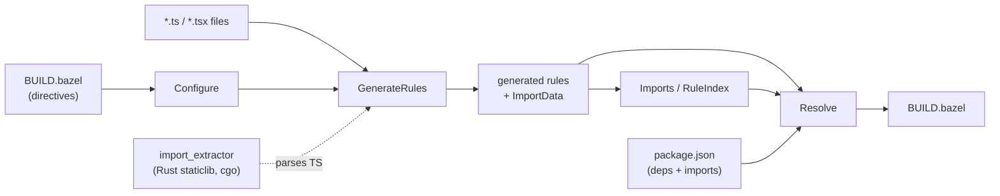

# gazelle_ts

Bazel build setup, a Gazelle TypeScript language extension, and the Rust
import extractor that powers it through cgo.

Built on **Bazel 8.5+ (bzlmod)** with
[`rules_rs`](https://github.com/dzbarsky/rules_rs) for the Rust side and
`aspect_rules_ts` / `aspect_rules_js` in the examples. CI tests the repo with
Bazel 8.5.1 and 9.0.0.

- [User Guide](#user-guide)
- [Supported Directives](#supported-directives)
- [Supported Rule Kinds](#supported-rule-kinds)
- [Import Resolution](#import-resolution)
- [Ambient Types And Globals](#ambient-types-and-globals)
- [Source Classification](#source-classification)
- [Generated Attrs](#generated-attrs)
- [Architecture](#architecture)
- [Repository Layout](#repository-layout)
- [Build](#build)

## User Guide

### 1. Add The Module

```starlark
# MODULE.bazel
bazel_dep(name = "gazelle", version = "0.50.0")
bazel_dep(name = "gazelle_ts", version = "<latest>")

# Required so the consumer .bazelrc below can reference @llvm directly.
# bzlmod does not transitively expose deps' repos.
bazel_dep(name = "llvm", version = "0.7.6")
```

`gazelle_ts` registers a hermetic `@llvm` cc toolchain so the `rules_rs` Rust
toolchain does not trip Bazel's Xcode autodetect on macOS. Mirror these flags
in the consumer workspace because Bazel only reads the consumer's rc files:

```text
common --enable_platform_specific_config

# Linux/Windows: pin host_platform so rules_rs's Rust toolchains match the
# gnu.2.28 libc / msvc constraints they tag via target_compatible_with.
common:linux --host_platform=@gazelle_ts//platforms:local_gnu
common:windows --host_platform=@gazelle_ts//platforms:local_windows_msvc

# Suppress Bazel's autodetected cc toolchain so @llvm wins resolution.
# NO_APPLE avoids the XcodeLocalEnvProvider duplicate-SDKROOT crash on macOS.
common --repo_env=BAZEL_DO_NOT_DETECT_CPP_TOOLCHAIN=1
common --repo_env=BAZEL_NO_APPLE_CPP_TOOLCHAIN=1

# rust stdlib's link spec hardcodes -lgcc_s; @llvm's clang does not ship it,
# so we inject an empty stub.
common --@llvm//config:experimental_stub_libgcc_s=True

# rules_go cgo external link via clang+lld cannot produce PIE. Drop when
# Go 1.27 lands PIE-compatible objects.
build:linux --linkopt=-no-pie
```

See [examples/basic/.bazelrc](examples/basic/.bazelrc) for a working setup.

### 2. Compose Gazelle With The TypeScript Language

`@gazelle_ts//ts` is a Gazelle language extension. Consumers compose their own
`gazelle_binary` so TypeScript can run alongside other languages such as Go,
Python, or proto.

```starlark
# BUILD.bazel
load("@gazelle//:def.bzl", "gazelle", "gazelle_binary")

# gazelle:ts_npm_link_pattern //:node_modules/{pkg}

gazelle_binary(
    name = "gazelle_bin",
    languages = ["@gazelle_ts//ts"],
)

gazelle(
    name = "gazelle",
    gazelle = ":gazelle_bin",
)
```

Then run:

```sh
bazel run //:gazelle
```

### 3. Map Abstract Kinds To Project Macros

The plugin deliberately emits abstract TypeScript-flavored kinds and leaves the
concrete rule implementation to the consumer. Add `map_kind` directives near
the workspace root:

```starlark
# gazelle:map_kind ts_library         myrepo_ts_library     //tools:ts.bzl
# gazelle:map_kind ts_test            myrepo_ts_test        //tools:ts.bzl
# gazelle:map_kind ts_binary          myrepo_ts_binary      //tools:ts.bzl
# gazelle:map_kind ts_bundler_config  myrepo_bundler_config //tools:ts.bzl
```

A typical wrapper file:

```starlark
load("@aspect_rules_ts//ts:defs.bzl", "ts_project")
load("@aspect_rules_js//js:defs.bzl", "js_binary", "js_test")

def myrepo_ts_library(name, srcs, **kwargs):
    ts_project(
        name = name,
        srcs = srcs,
        composite = True,
        declaration = True,
        declaration_map = True,
        source_map = True,
        # transpiler, default tsconfig, and other project defaults live here.
        **kwargs
    )

def myrepo_ts_test(name, srcs, deps = [], data = [], **kwargs):
    # Generated ts_test srcs are test entrypoints. Multi-entry runners can
    # forward srcs/deps/data directly; stock js_test needs one entry_point.
    js_test(name = name, data = srcs + deps + data, entry_point = srcs[0], **kwargs)

def myrepo_ts_binary(name, **kwargs):
    # Gazelle keeps data in sync from entry_point/srcs imports.
    js_binary(name = name, **kwargs)

def myrepo_bundler_config(name, srcs, **kwargs):
    ts_project(name = name, srcs = srcs, **kwargs)
```

If you skip `map_kind`, the fallbacks in `@gazelle_ts//ts:defs.bzl` collect
files into `filegroup`s so BUILD files still load, but they do not typecheck,
run tests, or build binaries.

### 4. Prefer `package.json` `imports` For Internal Paths

`gazelle_ts` reads the root `package.json` `imports` map and uses it for TS
dependency resolution. This is the preferred way to describe internal `#...`
subpath imports because the same map is visible to Node.js, TypeScript bundler
resolution, bundlers, and Gazelle.

```json
{
  "imports": {
    "#packages/*": "./packages/*",
    "#generated/typespec/rest/*/index.js": "./typespec/rest/*",
    "#generated/protobuf/*": [
      "./bazel-bin/generated/protobuf/*",
      "./generated/protobuf/*"
    ],
    "#generated/npm/*/index.js": "//generated/npm/*:*.web"
  }
}
```

Path targets such as `./typespec/rest/*` resolve through Gazelle's RuleIndex to
the longest matching TypeScript package. Literal Bazel labels beginning with
`//` or `@` are used directly as deps after substituting the `*` capture.

### 5. Route Generated Or Virtual Packages Explicitly

Use Gazelle's native `resolve` and `resolve_regexp` directives for imports that
are not in `package.json` dependencies and are not described by `imports`:

```starlark
# gazelle:resolve ts ts mystery:banner //tools:mystery
# gazelle:resolve_regexp ts ^@myrepo_generated/(.*)$ //:node_modules/@myrepo_generated/$1
```

Overrides win before every TypeScript-specific resolver path.

### 6. Configure Ambient Globals

For `.d.ts` packages that declare globals and are never imported, map the
global name to the provider label:

```starlark
# gazelle:ts_resolve_global process //:node_modules/@types/node
# gazelle:ts_resolve_global chrome //:node_modules/@types/chrome
# gazelle:ts_resolve_global import.meta.env //app/frontend/@types/app-env
# gazelle:ts_resolve_global R2Bucket //:node_modules/@cloudflare/workers-types
```

When source references those globals, Gazelle adds the provider to `deps` and
adds the inferred `compilerOptions.types` entry to `tsconfig_types`:

```starlark
ts_library(
    name = "worker",
    deps = [
        "//:node_modules/@cloudflare/workers-types",
        "//:node_modules/@types/node",
    ],
    tsconfig_types = [
        "@cloudflare/workers-types",
        "node",
    ],
)
```

### 7. Split Tests And Tooling Configs

Tests are separated from libraries by `ts_test_pattern`. Add patterns for
project-specific layouts:

```starlark
# gazelle:ts_test_pattern __tests__/**/*.ts
# gazelle:ts_test_pattern __tests__/**/*.tsx
```

Bundler and tooling configs can be held out of the library closure:

```starlark
# gazelle:ts_bundler_config_pattern vite.config.* vite_config
# gazelle:ts_bundler_config_pattern vitest.config.* vitest_config
# gazelle:ts_bundler_config_pattern tailwind.config.ts tailwind_config
# gazelle:ts_bundler_config_pattern .storybook/main.ts storybook_config
```

Use Gazelle's built-in `exclude` directive for files owned by another package
or another tool:

```starlark
# gazelle:exclude .storybook/**
# gazelle:exclude vitest.storybook.config.ts
```

### 8. Keep Hand-Written Binaries Managed

Gazelle never generates `ts_binary` or `js_binary`, but it recognizes existing
rules of those kinds, scans their `entry_point` and `srcs` imports, and keeps
`data` in sync. For `ts_binary`, it also manages `tsconfig_types`.

## Supported Directives

All TypeScript directives live in `BUILD.bazel` files as
`# gazelle:<key> <value>` and inherit into subdirectories unless a child
directory overrides or appends to them.

| Directive | Default | Behavior |
|---|---|---|
| `ts_enabled` | `true` | Enable or disable the TypeScript extension for the current tree. Accepts `true/false`, `1/0`, `yes/no`, and `on/off`. |
| `ts_library_name` | package basename, or `lib` at repo root | Name of the generated `ts_library`. |
| `ts_test_name` | package basename + `_test`, or `test` at repo root | Name of the generated `ts_test`. |
| `ts_visibility` | `//visibility:public` | Space-separated visibility labels. Replaces inherited visibility. |
| `ts_test_pattern` | `*.test.ts`, `*.test.tsx`, `tests/**`, `test/**`, `**/*.test.ts`, `**/*.test.tsx`, `**/*.spec.ts`, `**/*.spec.tsx` | Append a doublestar glob used to classify tests. |
| `ts_extension` | `.ts`, `.tsx` | Append a file extension treated as TypeScript input. |
| `ts_npm_link_pattern` | `//:node_modules/{pkg}` | Template for npm labels. `{pkg}` is replaced with the resolved package name, including scopes. |
| `ts_test_data` | empty | Append a label to every generated test rule's `data`. |
| `ts_tsconfig_types` | `node` | Append ambient type names that may be emitted in `tsconfig_types` when imported `@types/*` deps are resolved. This is an allowlist, not a list of every type dep; `ts_resolve_global` providers infer their own type names. |
| `ts_resolve_global` | empty | Add a `<global> <label>` mapping. Referencing the global adds the label to `deps` and infers a `tsconfig_types` entry. Longest matching global prefix wins. |
| `ts_bundler_config_pattern` | empty | Add a `<glob> <name>` mapping. Matching files are removed from library/test srcs and emitted as `ts_bundler_config(name = <name>)`. |

Useful Gazelle directives alongside `gazelle_ts`:

| Directive | Use |
|---|---|
| `map_kind` | Map `ts_library`, `ts_test`, `ts_binary`, and `ts_bundler_config` to concrete project macros. |
| `resolve` / `resolve_regexp` | Override arbitrary TypeScript imports before package, subpath, builtin, or npm resolution. Use language `ts`. |
| `exclude` | Remove files or directories from Gazelle's walk before this extension sees them. |

## Supported Rule Kinds

| Kind | Generated? | Managed attrs | Intended implementation |
|---|---:|---|---|
| `ts_library` | yes | `srcs`, `visibility`, `deps`, `tsconfig_types` | A wrapper over `ts_project` or equivalent compile rule. |
| `ts_test` | yes | `srcs`, `deps`, `data`, `tsconfig_types` | A wrapper over vitest, jest, mocha, `js_test`, or another runner. No `entry_point` is emitted. |
| `ts_bundler_config` | yes, from `ts_bundler_config_pattern` | `srcs`, `visibility`, `deps`, `tsconfig_types` | A wrapper over `ts_project` or equivalent tooling-config typecheck rule. |
| `ts_binary` | no | `data`, `tsconfig_types` | A hand-written binary rule mapped through `map_kind`. Gazelle scans `entry_point` / `srcs`. |
| `js_binary` | no | `data` | A hand-written stock rules_js binary. Gazelle scans `entry_point` / `srcs`. |

The plugin does not take a transitive dependency on `aspect_rules_ts` or
`aspect_rules_js`; the examples use those rules through local wrappers.

## Import Resolution

The Rust extractor parses TypeScript static imports, `import type`, inline
`import("pkg").Type`, dynamic imports, side-effect imports, and re-exports.
The resolver then checks each import in this order:

| Import shape | Example | Result |
|---|---|---|
| Same-package relative import | `./util` | No dep; the file is already in the package's `srcs`. |
| Cross-package relative import | `../shared/util` | Internal label found through the RuleIndex, when it crosses into another indexed TypeScript package. |
| Explicit override | `mystery:banner` with `gazelle:resolve ts ...` | Configured Bazel label. |
| Regexp override | `@myrepo_generated/foo` with `gazelle:resolve_regexp ts ...` | Configured Bazel label with captures substituted. |
| `package.json` subpath import | `#packages/core/user` | Internal RuleIndex label or literal Bazel label target from the `imports` map. |
| Node.js builtin | `fs`, `path`, `node:crypto` | `@types/node` via `ts_npm_link_pattern`; `node` is emitted in `tsconfig_types` by default. |
| Bare npm package | `react`, `lodash/fp` | Package label from `ts_npm_link_pattern`; paired `@types/<pkg>` is also added when present. |
| Scoped npm package | `@mui/material`, `@tanstack/react-query/devtools` | Scoped package label from `ts_npm_link_pattern`; paired DefinitelyTyped package uses `@types/scope__name` when present. |
| Type-only fallback | `import type { Foo } from "lodash"` when only `@types/lodash` is in deps | The `@types/lodash` package label. |
| Global reference | `R2Bucket` with `ts_resolve_global` | Configured provider label plus inferred `tsconfig_types`. |

Intentionally unsupported or skipped:

- CommonJS `require(...)` calls are not parsed.
- `tsconfig.json` `paths` mappings are not read. Use `package.json` `imports`
  or Gazelle `resolve` / `resolve_regexp` directives.
- Relative CSS and asset imports are skipped as source deps. Add runtime assets
  with `# keep`, `ts_test_data`, or a project-specific wrapper.

### `package.json` `imports`

At the repo root, Gazelle reads:

- `dependencies`
- `devDependencies`
- `optionalDependencies`
- `imports`

`imports` entries are matched by longest key first. A single `*` capture may
appear anywhere in the key and target. Gazelle follows Node's ordered target
model and uses the first target that resolves:

| Target shape | Example | Behavior |
|---|---|---|
| String | `"#foo": "./foo/index.js"` | Resolve the string target. |
| Array fallback | `"#foo": ["./bazel-bin/foo.js", "./foo.js"]` | Try entries in order. |
| Conditional object | `"#foo": {"types": "./foo.d.ts", "default": "./foo.js"}` | Evaluate supported conditions in declaration order; nested objects are supported. |
| `null` | `"#foo/private/*": null` | Treat as no mapping. |

Supported conditions are `types`, `node-addons`, `node`, `import`,
`module-sync`, and `default`. Other conditions are ignored unless a later
supported condition resolves.

## Ambient Types And Globals

`tsconfig_types` is only for ambient providers that belong in
`compilerOptions.types`. Ordinary module declaration packages such as
`@types/react` are still added as deps, but they are not listed in
`tsconfig_types` unless allowlisted by `ts_tsconfig_types`.

For imported packages, the `ts_tsconfig_types` allowlist controls which
resolved `@types/*` packages become `tsconfig_types`. The default allowlist is
`node`, so Node builtins add both `//:node_modules/@types/node` and `"node"`.

For global references, `ts_resolve_global` maps a global name or dotted prefix
to the ambient provider. Matching is exact or prefix-based (`google.picker`
matches `google.picker.DocumentObject`), and the longest configured global wins.
Type names are inferred as follows:

| Provider label | Inferred `tsconfig_types` |
|---|---|
| `//:node_modules/@types/node` | `node` |
| `//app/frontend/@types/app-env` | `app-env` |
| `//:node_modules/@cloudflare/workers-types` | `@cloudflare/workers-types` |
| `//types:custom-global-env` | `custom-global-env` |

Scoped ambient npm packages that match `ts_npm_link_pattern` keep their full
package name because values such as `"@cloudflare/workers-types"` are valid
`compilerOptions.types` entries.

## Source Classification

Gazelle partitions TypeScript files in each package before generating rules:

1. Files must match a configured `ts_extension`.
2. Files matching the longest `ts_bundler_config_pattern` become
   `ts_bundler_config` srcs.
3. Remaining files matching any `ts_test_pattern` become `ts_test` srcs.
4. Everything else becomes `ts_library` srcs.

Bundler-config classification wins over test classification. Multiple
bundler-config patterns can share the same target name; their files are merged.
If a config imports a relative helper that lives in the library, the config rule
depends on the sibling library. Imports from library sources into config files
are deliberately not routed back to the config target.

Generated files that would otherwise be dropped can be preserved with Gazelle's
normal `# keep` comments on the relevant attr.

## Generated Attrs

Attrs the plugin manages are listed below. Attrs not listed are left alone, so
wrapper-specific settings such as `tsconfig`, `transpiler`, `args`, `env`,
`fixed_args`, project-reference flags, and launcher settings survive Gazelle
runs.

### `ts_library`

| Attr | Set by | Behavior |
|---|---|---|
| `name` | generate | Required, from `ts_library_name` or package basename. |
| `srcs` | generate | Mergeable; preserves `# keep` lines. |
| `visibility` | generate | Replaced from `ts_visibility`. |
| `deps` | resolve | Replaced with resolved internal, npm, and global-provider labels. |
| `tsconfig_types` | resolve | Inferred ambient type names. |

### `ts_test`

| Attr | Set by | Behavior |
|---|---|---|
| `name` | generate | Required, from `ts_test_name` or package basename + `_test`. |
| `srcs` | generate | Mergeable test entrypoints. |
| `deps` | generate + resolve | Includes the sibling library when present plus imports from test files. |
| `data` | generate | Mergeable runtime fixtures from `ts_test_data` and `# keep`. |
| `tsconfig_types` | resolve | Inferred ambient type names for test-only imports/globals. |

### `ts_bundler_config`

| Attr | Set by | Behavior |
|---|---|---|
| `name` | generate | From `ts_bundler_config_pattern`'s `<name>`. |
| `srcs` | generate | Mergeable config files. |
| `visibility` | generate | Replaced from `ts_visibility`. |
| `deps` | resolve | Config-only imports plus sibling library when a relative helper is imported. |
| `tsconfig_types` | resolve | Inferred ambient type names. |

### `ts_binary` / `js_binary`

| Attr | Kind | Behavior |
|---|---|---|
| `entry_point` / `srcs` | both | Hand-written by the user; Gazelle scans these files. |
| `data` | both | Replaced with resolved deps from imports. |
| `tsconfig_types` | `ts_binary` only | Inferred ambient type names. |

## Architecture



Gazelle calls the language in three main phases:

1. **Configure** ([ts/configure.go](ts/configure.go)): clone inherited config
   and apply BUILD-file directives for the current directory. At the repo root,
   package.json dependencies and imports are loaded.
2. **GenerateRules** ([ts/generate.go](ts/generate.go)): partition files into
   library, test, bundler-config, and hand-written binary inputs; call the Rust
   extractor; and emit generated rules with attached import data.
3. **Imports / Resolve** ([ts/imports.go](ts/imports.go),
   [ts/resolve.go](ts/resolve.go)): register package import specs in the
   RuleIndex, then turn extracted imports and globals into Bazel labels.

The Rust crate at [crates/import_extractor](crates/import_extractor) is built
as a `rust_static_library` and linked into the Go language extension via
`cdeps`. Calls into it use a plugin-namespaced C ABI:
`gazelle_ts_ie_dispatch` / `gazelle_ts_ie_free`.

## Repository Layout

```text
crates/
  import_extractor/          Rust staticlib for TS import/global extraction
ts/                          Go Gazelle language extension
examples/                    Self-contained Bazel workspaces
  basic/                     One TS package, npm deps, .ts/.tsx, smoke test
  bundler-config/            Separate vite/vitest/tailwind config targets
  composite/                 Multi-package workspace with #packages/* refs
  graphql/                   @graphql-codegen -> npm_package -> app
  advanced/                  Composite + Bazel-built synthetic npm_package
```

The examples each have their own `MODULE.bazel`, `pnpm-lock.yaml`, and
`tsconfig.json`. They `local_path_override` this module so changes to the
plugin apply on the next `bazel run //:gazelle`. See
[examples/README.md](examples/README.md).

## Migrating From Older Direct Emission

If you are updating from a version that emitted `ts_project` / `js_test`
directly:

1. Add `map_kind` directives for `ts_library`, `ts_test`, and any generated
   `ts_bundler_config` rules.
2. Move project-reference compile flags (`composite`, `declaration`,
   `source_map`, `declaration_map`), `transpiler`, and `tsconfig` into wrapper
   macros.
3. Move `entry_point` handling into the `ts_test` wrapper, or use a multi-entry
   runner.
4. Drop directives that are now no-ops: `ts_project_references`,
   `ts_library_kind`, `ts_test_kind`, `ts_tsconfig`, `ts_transpiler`,
   `ts_test_entry_point`, and `ts_test_entry_point_auto`.
5. Re-run Gazelle.

## Build

```sh
bazel test //...
```

Tests in `crates/` and `ts/` run on linux-x86_64 and macos-arm64 in CI. The
example workspaces run on linux-x86_64 only.
