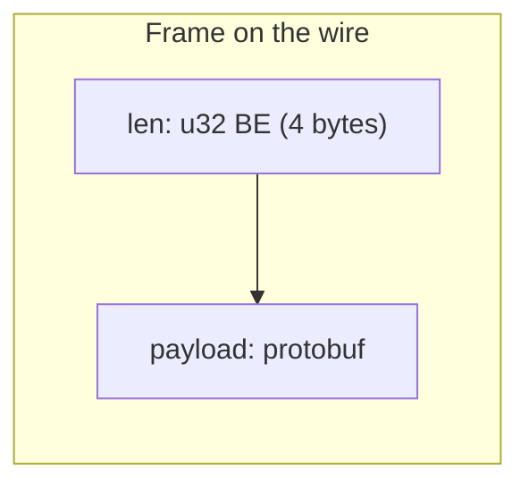
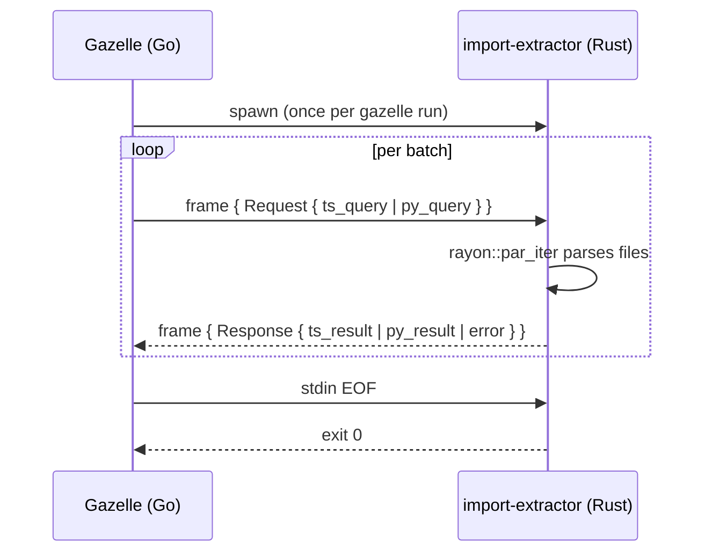

# import-extractor

Long-lived subprocess that extracts import paths from TypeScript and Python source files. Spawned by Gazelle plugins and kept alive for the duration of a Gazelle run; communicates over stdin/stdout using length-prefixed protobuf frames.

## Why a subprocess

Gazelle is written in Go. Parsing TypeScript and Python correctly enough to drive `BUILD.bazel` generation is significantly easier in Rust:

- **TypeScript** — `oxc` produces a real AST and recovers from partial edits, which matters because Gazelle often runs against a working tree mid-edit.
- **Python** — `ruff_python_parser` handles the full grammar including pattern matching, walrus operators, and type-checking-only imports.

Spawning per-file would dominate runtime. The binary instead stays alive and processes batched requests off stdin, parsing files in parallel via `rayon`.

## Wire protocol

Each frame is a 4-byte big-endian `u32` length followed by a `Request` or `Response` protobuf payload. See [`../import-extractor-proto/proto/message.proto`](../import-extractor-proto/proto/message.proto) for the full schema.





The binary reads frames from stdin, dispatches on `Request.data` (`ts_query` or `py_query`), and writes a `Response` frame to stdout per request. Errors during parsing of an individual file are logged to stderr and that file is skipped — the response only contains files that parsed successfully.

## Layout

```
src/
├── lib.rs       # re-exports python and ts modules
├── main.rs      # stdin/stdout loop + dispatch
├── ts.rs        # oxc-based TypeScript import extractor
└── python.rs    # ruff-based Python import extractor
```

## Build

With Bazel:

```
bazel build //crates/import-extractor:bin
bazel test  //crates/import-extractor:test
```

With Cargo (after `cargo generate-lockfile`):

```
cargo build --release -p import-extractor
cargo test  -p import-extractor
```

The Bazel build is the source of truth; the Cargo manifest is kept working so `rust-analyzer` and `cargo test` stay usable for development.

## Fixtures

Realistic sample inputs live in [`tests/fixtures/`](tests/fixtures):

- [`sample.ts`](tests/fixtures/sample.ts) — covers `import`, `import type`, `export from`, `export *`, dynamic `import('...')`, inline `import('...').Type`, scoped packages, subpaths, side-effect CSS, and `node:` builtins.
- [`sample.py`](tests/fixtures/sample.py) — covers `import`, `from ... import`, relative and double-relative imports, and `if TYPE_CHECKING` blocks.

## Performance notes

`Cargo.toml` sets `panic = "abort"` and `codegen-units = 1` for the release profile. The first reduces binary size and removes unwind tables; the second improves cross-crate inlining at the cost of slower compile times. Both meaningfully help startup latency for the gazelle plugin's hot path.
