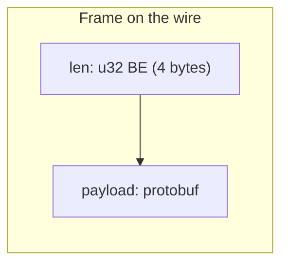
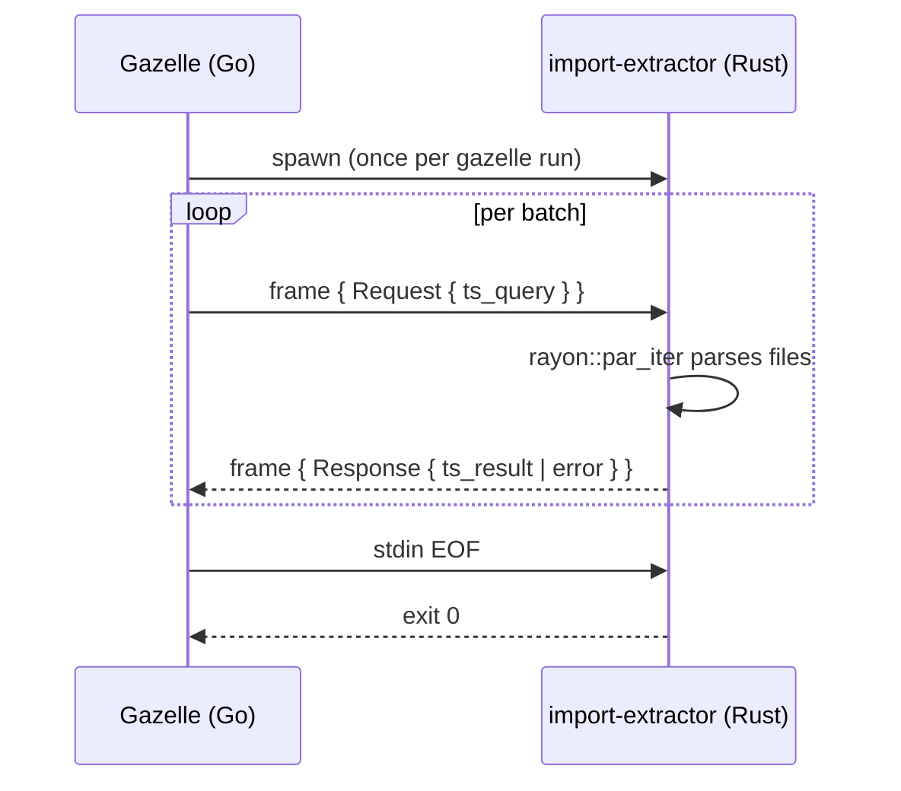

# import-extractor

Long-lived subprocess that extracts import paths from TypeScript source files. Spawned by Gazelle plugins and kept alive for the duration of a Gazelle run; communicates over stdin/stdout using length-prefixed protobuf frames.

## Why a subprocess

Gazelle is written in Go. Parsing TypeScript correctly enough to drive `BUILD.bazel` generation is significantly easier in Rust: `oxc` produces a real AST and recovers from partial edits, which matters because Gazelle often runs against a working tree mid-edit.

Spawning per-file would dominate runtime. The binary instead stays alive and processes batched requests off stdin, parsing files in parallel via `rayon`.

## Wire protocol

Each frame is a 4-byte big-endian `u32` length followed by a `Request` or `Response` protobuf payload. See [`proto/message.proto`](proto/message.proto) for the full schema.





The binary reads frames from stdin, dispatches on `Request.data` (`ts_query`), and writes a `Response` frame to stdout per request. Errors during parsing of an individual file are logged to stderr and that file is skipped — the response only contains files that parsed successfully.

## Layout

```
proto/
└── message.proto       # wire-protocol schema (built via rust_prost_library)
src/
├── lib.rs              # re-exports ts, wire modules
├── main.rs             # stdin/stdout I/O pump → wire::process_stream
├── wire.rs             # frame loop + request dispatch (testable)
└── ts.rs               # oxc-based TypeScript import extractor
tests/
├── integration.rs      # end-to-end stream tests
└── fixtures/           # realistic .ts samples
```

## Build

```
bazel build //crates/import-extractor:bin
bazel test  //crates/import-extractor:test
```

The proto codegen runs through `rust_prost_library`, so Bazel is the only supported build path for the binary. The library target (`ts`) compiles under cargo for `rust-analyzer` use.

## Fixtures

Realistic sample inputs live in [`tests/fixtures/`](tests/fixtures):

- [`sample.ts`](tests/fixtures/sample.ts) — covers `import`, `import type`, `export from`, `export *`, dynamic `import('...')`, inline `import('...').Type`, scoped packages, subpaths, side-effect CSS, and `node:` builtins.

## Performance notes

The workspace `[profile.release]` sets `panic = "abort"` and `codegen-units = 1`, and Bazel's `--config=opt` mirrors them via `@rules_rust//:extra_rustc_flags=-Ccodegen-units=1,-Cpanic=abort,-Cstrip=symbols`. The first reduces binary size and removes unwind tables; the second improves cross-crate inlining at the cost of slower compile times. Both meaningfully help startup latency for the gazelle plugin's hot path.
