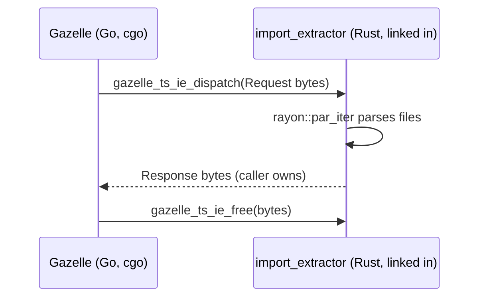

# import_extractor

Rust staticlib that extracts import paths, static CommonJS `require("...")`
calls, and global references from TypeScript source files. Linked into the
gazelle plugin's `go_library` via cgo and dispatched in-process — no subprocess,
no IPC.

## Why a Rust crate

Parsing TypeScript correctly enough to drive `BUILD.bazel` generation is significantly easier in Rust than Go: [`oxc`](https://oxc.rs/) produces a real AST and recovers from partial edits, which matters because Gazelle often runs against a working tree mid-edit. The crate parses files in parallel via `rayon`.

## C ABI

Two functions, declared in `src/ffi.rs`:

```c
void gazelle_ts_ie_dispatch(
    const uint8_t *req_ptr,
    size_t req_len,
    uint8_t **out_resp_ptr,
    size_t *out_resp_len);

void gazelle_ts_ie_free(uint8_t *ptr, size_t len);
```

`gazelle_ts_ie_dispatch` decodes a protobuf `Request`, parses the requested files in parallel, encodes a `Response`, and hands ownership of the buffer back via the out-parameters. The caller releases it with `gazelle_ts_ie_free`. The encoding is the same protobuf schema in [`proto/message.proto`](../../proto/message.proto) — it just runs in-process now.



## Layout

```
proto/
└── message.proto       # wire-protocol schema (built via rust_prost_library)
src/
├── lib.rs              # re-exports ffi, ts, wire modules
├── ffi.rs              # C ABI surface (gazelle_ts_ie_dispatch / gazelle_ts_ie_free)
├── wire.rs             # protobuf request/response dispatcher
└── ts.rs               # oxc-based TypeScript import/global extractor
```

## Build

```
bazel build //crates/import_extractor:import_extractor_static
bazel test  //crates/import_extractor:all
```

The `import_extractor_static` target produces a `.a` with `CcInfo`, which `//ts:ts` consumes via `cdeps` on its `go_library`.

## Performance notes

The workspace `[profile.release]` sets `panic = "abort"` and `codegen-units = 1`, and Bazel's `--config=opt` mirrors them via `@rules_rust//:extra_rustc_flags=-Ccodegen-units=1,-Cpanic=abort,-Cstrip=symbols,-Clto=thin`. Both meaningfully help the gazelle plugin's hot path — calls into the FFI run on every directory Gazelle visits.
