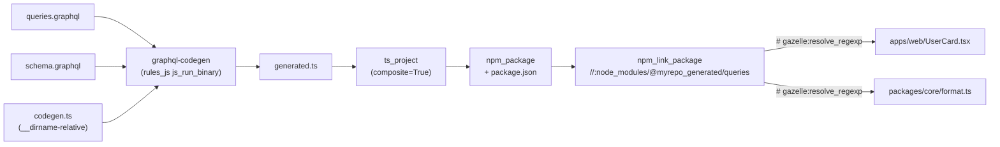

# examples/graphql

Codegens an `npm_package` from `.graphql` files using **`@graphql-codegen/cli`** as a real Bazel build step, links the result into `//:node_modules/@myrepo_generated/queries`, and consumes it from a composite TypeScript app.

## What it shows

The full chain:



Every step is in the build graph — change `queries.graphql`, gazelle's BUILD generation is unaffected, but `bazel build //...` re-runs codegen, retypechecks, repacks the npm output, and propagates the new types into every consumer.

## Layout

```
.
├── apps/web/UserCard.tsx           # imports @myrepo_generated/queries + #packages/core
├── packages/core/format.ts         # also imports @myrepo_generated/queries
└── schema/
    ├── schema.graphql              # type defs
    ├── queries.graphql             # operations
    ├── codegen.ts                  # graphql-codegen config (uses __dirname)
    ├── package.json                # name = @myrepo_generated/queries
    └── BUILD.bazel                 # graphql_codegen → ts_project → npm_package
```

## Wiring

[`schema/BUILD.bazel`](schema/BUILD.bazel):

1. **`graphql_codegen`** runs `@graphql-codegen/cli` with `--config codegen.ts`. The TS config uses `__dirname` so paths resolve to the sandbox layout, not the source tree. Output: `generated.ts`.
2. **`ts_project`** compiles `generated.ts` → `generated.js` + `generated.d.ts` (with `composite = True`).
3. **`npm_package`** wraps the compiled output + a hand-written `package.json` (`name: @myrepo_generated/queries`).

Root [`BUILD.bazel`](BUILD.bazel):

```starlark
npm_link_package(
    name = "node_modules/@myrepo_generated/queries",
    src = "//schema:queries",
    package = "@myrepo_generated/queries",
)

# gazelle:resolve_regexp ts ^@myrepo_generated/(.*)$ //:node_modules/@myrepo_generated/$1
```

The directive routes any `@myrepo_generated/*` import to the linker entry; gazelle emits it as a normal `deps` entry on every `ts_project` that imports the codegen output.

## Try it

```bash
bazel run //:gazelle    # regenerate BUILD files (apps/, packages/)
bazel build //...        # codegen → tsc → npm_package → consumers compile
```

## Why a `__dirname`-based codegen.ts

`graphql-codegen`'s yaml config resolves relative paths against the process CWD. Under Bazel sandboxing, CWD differs from the source tree, so `schema: schema.graphql` would fail. The TS config (`codegen.ts`) uses `join(__dirname, 'schema.graphql')`, which always resolves to wherever the config file actually lives — i.e. wherever Bazel staged the inputs.
