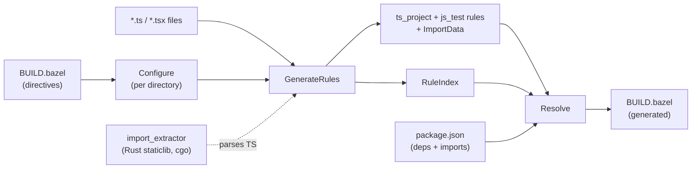

# ts (Gazelle TypeScript language extension)

A Gazelle language extension that generates and maintains BUILD files for TypeScript packages. It emits stock [`rules_ts`](https://github.com/aspect-build/rules_ts) and [`rules_js`](https://github.com/aspect-build/rules_js) rules, leaving every project-specific concern (custom macros, npm linker layout, project layout, test runner) configurable via directives or [`# gazelle:map_kind`](https://github.com/bazelbuild/bazel-gazelle#directives).

- [Quickstart](#quickstart)
- [Architecture](#architecture)
- [Supported import patterns](#supported-import-patterns)
- [Recommendations](#recommendations)
- [Directives](#directives)
- [Generated attrs](#generated-attrs)
- [How import resolution works](#how-import-resolution-works)
- [Running with a custom macro (`map_kind`)](#running-with-a-custom-macro-map_kind)

## Quickstart

Add a `BUILD.bazel` at the repo root with:

```starlark
load("@gazelle//:def.bzl", "gazelle", "gazelle_binary")

gazelle_binary(
    name = "gazelle_bin",
    languages = ["@gazelle_ts//ts"],
)

gazelle(
    name = "gazelle",
    gazelle = ":gazelle_bin",
)
```

Then run `bazel run //:gazelle`.

`@gazelle_ts//ts` is a Gazelle Language; you compose your own `gazelle_binary` so it can be combined with other languages (`go`, `python`, `proto`, …) into a single binary.

The plugin emits four abstract kinds, all loaded from `@gazelle_ts//ts:defs.bzl`:

- `ts_library` for libraries.
- `ts_test` for tests — assumes a multi-entry runner (vitest, jest, mocha); no `entry_point` is set.
- `ts_binary` for hand-written binary entry points — gazelle never generates these, but auto-manages the rule's `data` from `entry_point`/`srcs` imports (same lifecycle as stock `js_binary`).
- `ts_bundler_config` for files matched by `ts_bundler_config_pattern`.

Consumers must `# gazelle:map_kind` each to a project-specific macro (typically one-line wrappers over `ts_project` / `vitest_test` / `js_binary` / etc.). The plugin deliberately does not take a transitive `aspect_rules_ts` or `aspect_rules_js` dependency, and project-specific macros want their own defaults (transpiler, tsconfig, project-references compile flags, entry_point picking, NODE_OPTIONS, launcher script). See [§ Running with a custom macro](#running-with-a-custom-macro-map_kind).

`js_binary` is recognized too as a legacy/concrete alternative — same `data`-management lifecycle as `ts_binary`, no abstract-kind wrapping needed when you're happy with stock rules_js.

## Architecture



The plugin runs in three phases per Gazelle's lifecycle:

1. **Configure** ([`configure.go`](configure.go)) — walks the directory tree, applying each directory's BUILD-file directives on top of the inherited config.
2. **GenerateRules** ([`generate.go`](generate.go)) — for each directory, partitions files into source vs test, calls into the Rust staticlib via cgo to extract imports, and emits library + test rules.
3. **Resolve** ([`resolve.go`](resolve.go)) — converts the parsed import statements into Bazel deps using the RuleIndex (for cross-package refs) and `package.json` (for npm packages).

The Rust crate at [`crates/import_extractor`](../crates/import_extractor) is built as a `rust_static_library` and linked into this `go_library` via `cdeps`. Calls into it go through cgo — no subprocess, no IPC; the wire format (protobuf via `prost`) is just the in-process marshalling. See the crate's README for the C ABI.

The plugin's separation of `Imports` (provider side) from `Resolve` (consumer side) is what makes cross-directory `references` work: `Imports()` registers each library at its package path in the RuleIndex, and `Resolve()` queries that index to convert `#packages/foo/bar.ts` style paths into `//packages/foo` labels.

## Supported import patterns

The Rust parser handles every TypeScript import form; the resolver categorizes each one. Listed in roughly the order the resolver checks them:

| Pattern | Example | Resolves to |
|---|---|---|
| **Relative** | `./util`, `../shared/types` | _no dep added_ — covered by the package's own srcs |
| **Generated package** | `@myrepo_generated/foo` (when configured via `ts_generated_package`) | The configured Bazel label, with `*` substituted |
| **Subpath import** | `#packages/foo/bar.ts` (when `package.json` has `"#packages/*": "./packages/*"`) | An internal `//packages/foo` label looked up via the RuleIndex |
| **Node.js builtin** | `fs`, `path`, `node:crypto` | `//:node_modules/@types/node` (configurable via `ts_npm_link_pattern`) |
| **Bare npm package** | `react`, `lodash` | `//:node_modules/react`, plus `//:node_modules/@types/react` if present |
| **Scoped npm package** | `@mui/material`, `@tanstack/react-query` | `//:node_modules/@mui/material` |
| **npm subpath** | `lodash/debounce`, `@tanstack/react-query/devtools` | `//:node_modules/lodash` (the package, not the subpath — Bazel's npm linker handles subpath resolution at runtime) |
| **Type-only `import type`** | `import type { Foo } from 'react'` | Same as the runtime import — TypeScript needs the dep at type-check time |
| **Inline import type** | `import('postcss').Root` | Same as a regular `import 'postcss'` |
| **Dynamic import** | `await import('lazy-mod')` | Same as `import 'lazy-mod'` |
| **Side-effect import** | `import 'reflect-metadata'`, `import './styles.css'` | Same as a regular import |
| **Re-export from** | `export * from 'foo'`, `export { x } from 'foo'` | Same as `import 'foo'` |

A few cases that are intentionally **not** resolved:

- **CSS / asset imports** (`import './styles.css'`) are returned as raw strings; the resolver skips them as relative imports. If your build needs them as `data` deps, add them via `# keep` lines or a `ts_test_data` directive.
- **TypeScript path mapping** (`tsconfig.json`'s `paths` field) is not honored. Use `ts_generated_package` or rely on `package.json` `imports` instead — both are stricter than `paths` and play nicely with the Bazel sandbox.
- **`require(...)` calls** are not parsed. The plugin is TypeScript-first; CommonJS in `.ts` files is rare in practice.

## Recommendations

- **Wire a concrete library macro via `# gazelle:map_kind ts_library …`.** The plugin emits the abstract `ts_library` kind; consumers wrap it in a one-line macro forwarding to `ts_project` (and setting project-specific defaults: transpiler, project-references compile flags). Without map_kind, the fallback in `@gazelle_ts//ts:defs.bzl` collects srcs into a `filegroup` so the BUILD still loads — but nothing typechecks. See [§ Running with a custom macro](#running-with-a-custom-macro-map_kind).
- **Use `package.json` `imports` for internal cross-package references.** Configuring `"#packages/*": "./packages/*"` lets you write `import { foo } from '#packages/utils/x.js'` in source AND have TypeScript / Node.js / the bundler all agree on resolution. The plugin reads the same map and resolves to internal Bazel labels. This is strictly better than tsconfig's `paths` field, which Node.js and most bundlers ignore.
- **In monorepos, set TypeScript project references in your wrapper macro.** Set `composite = True`, `declaration = True`, `source_map = True` inside the macro behind `ts_library`; the wrapper runs once and applies to every emitted library. The plugin doesn't emit those attrs — they're a compile-shape choice the macro owns.
- **Pin one npm linker layout via `ts_npm_link_pattern`.** rules_js's pnpm projects typically use `//<dir>:node_modules/{pkg}`; the default `//:node_modules/{pkg}` is right for the simplest setup. Setting this once at the repo root keeps every emitted dep consistent.
- **Don't fight the merge engine.** Attrs the plugin sets are listed in [§ Generated attrs](#generated-attrs); attrs we don't set are preserved across runs. Manual overrides (custom `transpiler`, extra `args`, opt-in `declaration_dir`) survive — that's by design.
- **Annotate generated files with `# keep`.** If a file would be excluded by the test pattern but you want it in `srcs` (e.g. a `*.generated.ts` checked-in fixture), add `"foo.generated.ts",  # keep` to the `srcs` list. The merge engine preserves it.

## Directives

All directives are placed in `BUILD.bazel` as `# gazelle:<key> <value>` and inherit into subdirectories.

| Directive | Default | Notes |
|---|---|---|
| `ts_enabled` | `true` | Disable per-tree to skip directories owned by another tool. |
| `ts_library_name` | _(package basename, e.g. `web` for `//apps/web`)_ | Name of the generated library rule. |
| `ts_test_name` | _(package basename + `_test`, e.g. `web_test`)_ | Name of the generated test rule. |
| `ts_visibility` | `//visibility:public` | Repeatable / space-separated list. |
| `ts_test_pattern` | `*.test.ts`, `*.test.tsx`, `tests/**`, `test/**` | Repeatable; appended. |
| `ts_extension` | `.ts`, `.tsx` | Repeatable; appended. |
| `ts_npm_link_pattern` | `//:node_modules/{pkg}` | Template; `{pkg}` is replaced with the resolved package name. |
| `ts_generated_package` | _(from `package.json` `imports`)_ | Repeatable `pattern=target` entries; maps a generated/synthetic package namespace to a Bazel label. Merged on top of `package.json`. |
| `ts_test_data` | _(empty)_ | Repeatable; appended to every test rule's `data`. |
| `ts_bundler_config_pattern` | _(empty)_ | Repeatable `<glob> <name>` entries. Files matching the glob are excluded from the library and emitted as a separate `ts_bundler_config` target named `<name>`. Use for vite/vitest/tailwind/storybook configs whose deps should not enter the lib's compilation closure. |

### `ts_generated_package` examples

```
# Map @myrepo_generated/* directly to a Bazel label
# gazelle:ts_generated_package @myrepo_generated/*=//:node_modules/@myrepo_generated/*

# Map a Node.js subpath import (#packages/*) to a workspace path so the plugin
# can look up internal libraries by package path. (You normally don't need this
# directive — the same mapping read from package.json works.)
# gazelle:ts_generated_package #packages/*=./packages/*
```

The first form (target starts with `//` or `@`) is taken as a Bazel label literal. The second form (relative path) is treated as a workspace path; the plugin walks the rule index to find the longest matching package.

### `ts_bundler_config_pattern` examples

Bundler/tooling config files (vite, vitest, tailwind, storybook) typically live alongside library sources but pull in build-time-only deps (`vite`, `@vitejs/plugin-react`, `vitest`) that should not enter the library's runtime closure. Worse, if those deps end up on the library rule, nothing structurally prevents lib code from importing the config file and re-introducing the coupling. `ts_bundler_config_pattern` peels each matched file into a separate `ts_bundler_config` target so it typechecks as its own compilation unit.

```
# gazelle:ts_bundler_config_pattern vite.config.* vite_config
# gazelle:ts_bundler_config_pattern vitest.config.* vitest_config
# gazelle:ts_bundler_config_pattern tailwind.config.ts tailwind_config
# gazelle:ts_bundler_config_pattern .storybook/main.ts storybook_config
```

For a package laid out like:

```
app/
├── BUILD.bazel
├── index.ts                # imports react, ./helpers
├── helpers.ts              # imports lodash
├── vite.config.ts          # imports vite, @vitejs/plugin-react, ./viteHelpers
├── viteHelpers.ts          # imports node:path
└── index.test.ts           # imports vitest, ./index
```

the plugin emits (kinds shown pre-`map_kind` rewrite):

```python
ts_library(
    name = "app",
    srcs = ["helpers.ts", "index.ts", "viteHelpers.ts"],
    deps = ["//:node_modules/lodash", "//:node_modules/react"],
)

ts_bundler_config(
    name = "vite_config",
    srcs = ["vite.config.ts"],
    deps = [
        "//:node_modules/@vitejs/plugin-react",
        "//:node_modules/vite",
        ":app",  # vite.config.ts imports ./viteHelpers, which lives in :app
    ],
)

js_test(
    name = "app_test",
    data = [":app", "//:node_modules/vitest", "index.test.ts"],
    entry_point = "index.test.ts",
)
```

Key behaviors:

- **Glob syntax** is full doublestar: `*` is a single-segment wildcard (`vite.config.*` matches `vite.config.ts`, `vite.config.production.ts`); `**` spans directories.
- **Longest pattern wins** when multiple specs match the same file.
- **Bundler-config classification overrides the test split** — a file matching both `*.test.ts` and a bundler-config pattern goes to the bundler-config target.
- **Multiple specs may share a name** — pointing several patterns at one target merges their files into a single rule.
- **Helpers stay in lib.** If `vite.config.ts` and `lib.ts` both import `./shared.ts`, `shared.ts` lands in the library and the bundler-config target adds `:lib` to its deps. The closure leaks bundler→lib but never lib→bundler.
- **`lib.ts` importing a bundler-config file is a build error.** The resolver does not route the import to the bundler-config target; the import goes unresolved and the typecheck fails. This is the boundary the directive enforces — silently re-routing would defeat the purpose.

`ts_bundler_config`, like `ts_library`, is an abstract kind requiring `map_kind`. The distinct kind name is the lever for project customization: `map_kind ts_bundler_config <macro>` rewrites bundler-config emissions independently of `ts_library`. See [`examples/bundler-config`](../examples/bundler-config) for a complete walkthrough.

## Generated attrs

### `ts_library` (abstract)

| Attr | Set by | Behavior |
|---|---|---|
| `name` | generate | non-empty required |
| `srcs` | generate | mergeable, preserves `# keep` lines |
| `visibility` | generate | overwritten each run |
| `deps` | resolve | replaced each run |
| anything else | _untouched_ | manual overrides survive across runs |

`composite`, `declaration`, `source_map`, `transpiler`, `tsconfig` etc. are **not** emitted by the plugin — they belong to the macro you map_kind `ts_library` to.

### `ts_test` (abstract)

| Attr | Set by | Behavior |
|---|---|---|
| `name` | generate | non-empty required |
| `data` | generate + resolve | mergeable; carries test sources, fixtures, npm packages, sibling lib |
| anything else | _untouched_ | manual overrides survive across runs |

No `entry_point` — `ts_test` assumes a multi-entry runner (vitest, jest, mocha). Wrappers mapped to single-entry runners (stock `js_test`) need to pick one from `data` themselves.

### `ts_binary` / `js_binary` (hand-written, data-managed)

| Attr | Set by | Behavior |
|---|---|---|
| `name` | _user_ | hand-written |
| `entry_point` / `srcs` | _user_ | hand-written; gazelle scans these for imports |
| `data` | resolve | replaced each run with resolved deps from imports |
| anything else | _untouched_ | manual overrides survive across runs |

Gazelle never generates either kind. It piggybacks on the user's existing rule, scans `entry_point`/`srcs` for TS imports, and fills in `data`. Use `ts_binary` (abstract, lives at `@gazelle_ts//ts:defs.bzl`) when you want `# gazelle:map_kind` to swap implementations without touching gazelle config; use `js_binary` (concrete, from `@aspect_rules_js//js:defs.bzl`) when stock rules_js works as-is.

### `ts_bundler_config` (abstract)

| Attr | Set by | Behavior |
|---|---|---|
| `name` | generate | from the directive's `<name>` argument |
| `srcs` | generate | mergeable; one entry per matched file |
| `visibility` | generate | overwritten each run |
| `deps` | resolve | replaced each run; includes sibling lib label when the config has any relative imports |
| anything else | _untouched_ | manual overrides survive across runs |

## How import resolution works

1. `package.json` is read once at the repo root for `dependencies` / `devDependencies` / `optionalDependencies` / `imports`.
2. Per import:
   - **Relative** (`./foo`, `../bar`): no dep added.
   - **Generated package or subpath** (matches a key in the merged `package.json` `imports` + `ts_generated_package` map): resolves to either a literal Bazel label (when target starts with `//` or `@`) or an internal repo label found via the RuleIndex.
   - **Node.js builtin**: resolves to `@types/node`.
   - **npm package**: resolves to `{npmLinkPattern}` with `{pkg}` replaced; auto-pairs `@types/<pkg>` if present in deps.
3. Library rules collect every resolved label into `deps`. Test and bundler-config rules do the same into `data`/`deps`.
4. `Imports()` registers each library's package path in the RuleIndex so other directories can look it up via `FindRulesByImportWithConfig`.

## Running with a custom macro (`map_kind`)

All three kinds are abstract; wire each to a concrete macro at your root BUILD:

```starlark
# gazelle:map_kind ts_library         myrepo_ts_library     //tools:ts.bzl
# gazelle:map_kind ts_test            myrepo_ts_test        //tools:ts.bzl
# gazelle:map_kind ts_binary          myrepo_ts_binary      //tools:ts.bzl
# gazelle:map_kind ts_bundler_config  myrepo_bundler_config //tools:ts.bzl
```

A typical `tools/ts.bzl`:

```starlark
load("@aspect_rules_ts//ts:defs.bzl", "ts_project")
load("@aspect_rules_js//js:defs.bzl", "js_test")

def myrepo_ts_library(name, srcs, **kwargs):
    ts_project(
        name = name,
        srcs = srcs,
        composite = True,
        declaration = True,
        declaration_map = True,
        source_map = True,
        # transpiler, default tsconfig, etc. baked in here.
        **kwargs
    )

def myrepo_ts_test(name, data, **kwargs):
    # Pick the first .test.ts* from data as entry_point for stock js_test;
    # if you've moved to vitest_test/jest_test, drop this and forward data
    # to the runner directly.
    entry = None
    for d in data:
        if d.endswith(".test.ts") or d.endswith(".test.tsx"):
            entry = d
            break
    js_test(name = name, data = data, entry_point = entry, **kwargs)

def myrepo_ts_binary(name, **kwargs):
    # Same pattern as a stock js_binary wrapper — gazelle keeps `data`
    # in sync from the rule's entry_point/srcs imports; the wrapper
    # bakes in launcher / NODE_OPTIONS / chdir defaults.
    js_binary(name = name, **kwargs)

def myrepo_bundler_config(name, srcs, **kwargs):
    ts_project(name = name, srcs = srcs, **kwargs)
```

If you skip `map_kind`, the fallback in `@gazelle_ts//ts:defs.bzl` collects srcs/data into a `filegroup` (so the BUILD still loads) but doesn't typecheck or run tests — you'll see a `print` warning telling you to add the directive.

## Migrating from `ts_project`

If you're updating from a version that emitted `ts_project` / `js_test` directly:

1. Add `# gazelle:map_kind` directives for `ts_library`, `ts_test`, and (if used) `ts_bundler_config` at your root BUILD.
2. Move project-references compile flags (`composite`, `declaration`, `source_map`, `declaration_map`), `transpiler`, and `tsconfig` into your wrapper macro — the plugin no longer emits them.
3. Move `entry_point` handling into your `ts_test` wrapper (pick from `data`, or use a multi-entry runner).
4. Drop directives that are now no-ops: `ts_project_references`, `ts_library_kind`, `ts_test_kind`, `ts_tsconfig`, `ts_transpiler`, `ts_test_entry_point`, `ts_test_entry_point_auto`.
5. Re-run gazelle. Old `ts_project` / `js_test` rules will be replaced by your wrapper kinds.
