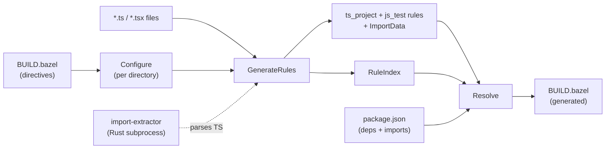

# ts (Gazelle TypeScript language extension)

A Gazelle language extension that generates and maintains BUILD files for TypeScript packages. It emits stock [`rules_ts`](https://github.com/aspect-build/rules_ts) and [`rules_js`](https://github.com/aspect-build/rules_js) rules, leaving every project-specific concern (custom macros, npm linker layout, project layout, test runner) configurable via directives or [`# gazelle:map_kind`](https://github.com/bazelbuild/bazel-gazelle#directives).

- [Quickstart](#quickstart)
- [Architecture](#architecture)
- [Supported import patterns](#supported-import-patterns)
- [Recommendations](#recommendations)
- [Directives](#directives)
- [Generated attrs](#generated-attrs)
- [How import resolution works](#how-import-resolution-works)
- [Running with a custom macro (`map_kind`)](#running-with-a-custom-macro-map_kind)

## Quickstart

Add a `BUILD.bazel` at the repo root with:

```starlark
load("@gazelle//:def.bzl", "gazelle", "gazelle_binary")

gazelle_binary(
    name = "gazelle_bin",
    languages = ["@gazelle_ts//ts"],
)

gazelle(
    name = "gazelle",
    gazelle = ":gazelle_bin",
)
```

Then run `bazel run //:gazelle`.

`@gazelle_ts//ts` is a Gazelle Language; you compose your own `gazelle_binary` so it can be combined with other languages (`go`, `python`, `proto`, …) into a single binary.

By default the plugin emits:

- `ts_project` for libraries (loaded from `@aspect_rules_ts//ts:defs.bzl`)
- `js_test` for tests (loaded from `@aspect_rules_js//js:defs.bzl`)

If you have your own macros, use `# gazelle:map_kind` to swap (see [§ Running with a custom macro](#running-with-a-custom-macro-map_kind)).

## Architecture



The plugin runs in three phases per Gazelle's lifecycle:

1. **Configure** ([`configure.go`](configure.go)) — walks the directory tree, applying each directory's BUILD-file directives on top of the inherited config.
2. **GenerateRules** ([`generate.go`](generate.go)) — for each directory, partitions files into source vs test, batches them into the Rust subprocess for import extraction, and emits library + test rules.
3. **Resolve** ([`resolve.go`](resolve.go)) — converts the parsed import statements into Bazel deps using the RuleIndex (for cross-package refs) and `package.json` (for npm packages).

The Rust subprocess at [`crates/import_extractor`](../crates/import_extractor) is spawned once per Gazelle run and shut down at `DoneGeneratingRules`. Communication is length-prefixed protobuf frames over stdin/stdout — see the subprocess's README for the wire schema.

### Locating the import-extractor binary

The plugin tries three sources, in order:

1. **`$IMPORT_EXTRACTOR_BIN`** — explicit absolute path. Use this when shipping a prebuilt binary outside Bazel (release artifact, vendored tool, CI cache):
   ```bash
   IMPORT_EXTRACTOR_BIN=/usr/local/bin/import_extractor bazel run //:gazelle
   ```
   A non-existent path is logged and the lookup falls through to the next source.
2. **Bazel runfiles** — `gazelle_ts/crates/import_extractor/bin`. The `ts` go_library declares `data = ["//crates/import_extractor:bin"]`, so any consumer-built `gazelle_binary` automatically carries the binary into runfiles.
3. **`$PATH`** — looks for an `import_extractor` executable on PATH. Picks up a `cargo install`-style global install or anything dropped on PATH by a dev environment manager.

If none match, the plugin logs a warning and skips parsing instead of aborting the gazelle run — every TS file is treated as having no imports, so generated `deps` will be empty until the binary is reachable.

The plugin's separation of `Imports` (provider side) from `Resolve` (consumer side) is what makes cross-directory `references` work: `Imports()` registers each library at its package path in the RuleIndex, and `Resolve()` queries that index to convert `#packages/foo/bar.ts` style paths into `//packages/foo` labels.

## Supported import patterns

The Rust parser handles every TypeScript import form; the resolver categorizes each one. Listed in roughly the order the resolver checks them:

| Pattern | Example | Resolves to |
|---|---|---|
| **Relative** | `./util`, `../shared/types` | _no dep added_ — covered by the package's own srcs |
| **Generated package** | `@myrepo_generated/foo` (when configured via `ts_generated_package`) | The configured Bazel label, with `*` substituted |
| **Subpath import** | `#packages/foo/bar.ts` (when `package.json` has `"#packages/*": "./packages/*"`) | An internal `//packages/foo` label looked up via the RuleIndex |
| **Node.js builtin** | `fs`, `path`, `node:crypto` | `//:node_modules/@types/node` (configurable via `ts_npm_link_pattern`) |
| **Bare npm package** | `react`, `lodash` | `//:node_modules/react`, plus `//:node_modules/@types/react` if present |
| **Scoped npm package** | `@mui/material`, `@tanstack/react-query` | `//:node_modules/@mui/material` |
| **npm subpath** | `lodash/debounce`, `@tanstack/react-query/devtools` | `//:node_modules/lodash` (the package, not the subpath — Bazel's npm linker handles subpath resolution at runtime) |
| **Type-only `import type`** | `import type { Foo } from 'react'` | Same as the runtime import — TypeScript needs the dep at type-check time |
| **Inline import type** | `import('postcss').Root` | Same as a regular `import 'postcss'` |
| **Dynamic import** | `await import('lazy-mod')` | Same as `import 'lazy-mod'` |
| **Side-effect import** | `import 'reflect-metadata'`, `import './styles.css'` | Same as a regular import |
| **Re-export from** | `export * from 'foo'`, `export { x } from 'foo'` | Same as `import 'foo'` |

A few cases that are intentionally **not** resolved:

- **CSS / asset imports** (`import './styles.css'`) are returned as raw strings; the resolver skips them as relative imports. If your build needs them as `data` deps, add them via `# keep` lines or a `ts_test_data` directive.
- **TypeScript path mapping** (`tsconfig.json`'s `paths` field) is not honored. Use `ts_generated_package` or rely on `package.json` `imports` instead — both are stricter than `paths` and play nicely with the Bazel sandbox.
- **`require(...)` calls** are not parsed. The plugin is TypeScript-first; CommonJS in `.ts` files is rare in practice.

## Recommendations

- **Use `package.json` `imports` for internal cross-package references.** Configuring `"#packages/*": "./packages/*"` lets you write `import { foo } from '#packages/utils/x.js'` in source AND have TypeScript / Node.js / the bundler all agree on resolution. The plugin reads the same map and resolves to internal Bazel labels. This is strictly better than tsconfig's `paths` field, which Node.js and most bundlers ignore.
- **Turn on `ts_project_references`** in monorepos. It maps to TypeScript [project references](https://www.typescriptlang.org/docs/handbook/project-references.html) and gives you incremental builds and proper cross-package type-checking. The plugin emits `composite = True`, `declaration = True`, `source_map = True`, and a resolved `references` attr automatically.
- **Pin one npm linker layout via `ts_npm_link_pattern`.** rules_js's pnpm projects typically use `//<dir>:node_modules/{pkg}`; the default `//:node_modules/{pkg}` is right for the simplest setup. Setting this once at the repo root keeps every emitted dep consistent.
- **Prefer `# gazelle:map_kind` over `ts_library_kind`/`ts_test_kind`.** map_kind keeps the load path explicit in the generated BUILD file, which is what you want when reviewing diffs. Use the directive overrides only when you can't use map_kind (e.g. when the consumer macro lives in a non-load-statement-friendly path).
- **Don't fight the merge engine.** Attrs the plugin sets are listed in [§ Generated attrs](#generated-attrs); attrs we don't set are preserved across runs. Manual overrides (custom `transpiler`, extra `args`, opt-in `declaration_dir`) survive — that's by design.
- **Annotate generated files with `# keep`.** If a file would be excluded by the test pattern but you want it in `srcs` (e.g. a `*.generated.ts` checked-in fixture), add `"foo.generated.ts",  # keep` to the `srcs` list. The merge engine preserves it.

## Directives

All directives are placed in `BUILD.bazel` as `# gazelle:<key> <value>` and inherit into subdirectories.

| Directive | Default | Notes |
|---|---|---|
| `ts_enabled` | `true` | Disable per-tree to skip directories owned by another tool. |
| `ts_library_name` | _(package basename, e.g. `web` for `//apps/web`)_ | Name of the generated library rule. |
| `ts_test_name` | _(package basename + `_test`, e.g. `web_test`)_ | Name of the generated test rule. |
| `ts_library_kind` | `ts_project` | Override emitted library kind without `map_kind`. |
| `ts_test_kind` | `js_test` | Override emitted test kind without `map_kind`. |
| `ts_visibility` | `//visibility:public` | Repeatable / space-separated list. |
| `ts_test_pattern` | `*.test.ts`, `*.test.tsx`, `tests/**`, `test/**` | Repeatable; appended. |
| `ts_extension` | `.ts`, `.tsx` | Repeatable; appended. |
| `ts_project_references` | `true` | Emits `composite = True` and the resolved `references` attr. |
| `ts_tsconfig` | _(unset)_ | Set to a Bazel label to emit `tsconfig` on every library. |
| `ts_npm_link_pattern` | `//:node_modules/{pkg}` | Template; `{pkg}` is replaced with the resolved package name. |
| `ts_generated_package` | _(from `package.json` `imports`)_ | Repeatable `pattern=target` entries; maps a generated/synthetic package namespace to a Bazel label. Merged on top of `package.json`. |
| `ts_test_data` | _(empty)_ | Repeatable; appended to every test rule's `data`. |
| `ts_test_entry_point` | _first matching `*.test.ts*`_ | Override the entry point picked for tests. |

### `ts_generated_package` examples

```
# Map @myrepo_generated/* directly to a Bazel label
# gazelle:ts_generated_package @myrepo_generated/*=//:node_modules/@myrepo_generated/*

# Map a Node.js subpath import (#packages/*) to a workspace path so the plugin
# can look up internal libraries by package path. (You normally don't need this
# directive — the same mapping read from package.json works.)
# gazelle:ts_generated_package #packages/*=./packages/*
```

The first form (target starts with `//` or `@`) is taken as a Bazel label literal. The second form (relative path) is treated as a workspace path; the plugin walks the rule index to find the longest matching package.

## Generated attrs

### `ts_project`

| Attr | Set by | Behavior |
|---|---|---|
| `name` | generate | non-empty required |
| `srcs` | generate | mergeable, preserves `# keep` lines |
| `visibility` | generate | overwritten each run |
| `deps` | resolve | replaced each run |
| `references` | resolve | replaced when `ts_project_references = true` |
| `composite`, `declaration`, `source_map` | generate | only when `ts_project_references = true` |
| `tsconfig` | generate | only when `ts_tsconfig` directive is set |
| anything else | _untouched_ | manual overrides survive across runs |

### `js_test`

| Attr | Set by | Behavior |
|---|---|---|
| `name` | generate | non-empty required |
| `srcs` | generate | mergeable |
| `data` | generate | mergeable |
| `deps` | resolve | replaced each run |
| `entry_point` | generate | from `ts_test_entry_point` or first `*.test.ts*` |
| anything else | _untouched_ | |

## How import resolution works

1. `package.json` is read once at the repo root for `dependencies` / `devDependencies` / `optionalDependencies` / `imports`.
2. Per import:
   - **Relative** (`./foo`, `../bar`): no dep added.
   - **Generated package or subpath** (matches a key in the merged `package.json` `imports` + `ts_generated_package` map): resolves to either a literal Bazel label (when target starts with `//` or `@`) or an internal repo label found via the RuleIndex.
   - **Node.js builtin**: resolves to `@types/node`.
   - **npm package**: resolves to `{npmLinkPattern}` with `{pkg}` replaced; auto-pairs `@types/<pkg>` if present in deps.
3. Library rules get `deps` (npm) and `references` (internal). Test rules collapse both into `deps` (a test typically links everything its source linked, plus its own deps).
4. `Imports()` registers each library's package path in the RuleIndex so other directories can look it up via `FindRulesByImportWithConfig`.

## Running with a custom macro (`map_kind`)

Suppose you want to emit your own `myrepo_ts_library` macro instead of stock `ts_project`. Add to your root BUILD file:

```starlark
# gazelle:map_kind ts_project myrepo_ts_library //tools:ts.bzl
# gazelle:map_kind js_test    myrepo_ts_test    //tools:ts.bzl
```

The plugin still emits the stock kinds; gazelle rewrites the kind name and load path on disk. Your macro must accept the attrs the plugin sets (see [§ Generated attrs](#generated-attrs) above). If your macro doesn't accept `composite`, `declaration`, etc., either turn them off via `# gazelle:ts_project_references false` or have your macro discard them.

A common pattern is for `myrepo_ts_library` to wrap `ts_project` and add project-specific defaults (a default tsconfig, transpiler choice, npm packaging metadata). The wrapper accepts `srcs`, `deps`, `references` and forwards them; everything else flows through.
